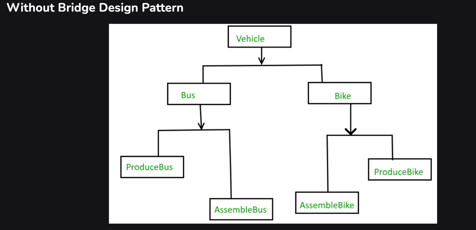
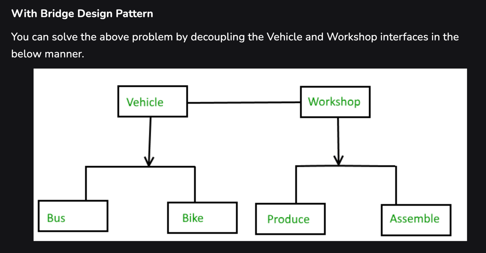

# Bridge design pattern

- The Bridge design pattern allows you to separate the abstraction from the implementation.
- It is a structural design pattern
- There are 2 parts in Bridge design pattern :
  - Abstraction
  - Implementation

## This is a design mechanism that encapsulates an implementation class inside of an interface class.

- The bridge pattern allows the Abstraction and the Implementation to be developed independently and 
- the client code can access only the Abstraction part without being concerned about the Implementation part.
- The abstraction is an interface or abstract class and the implementer is also an interface or abstract class.
- The abstraction contains a reference to the implementer. 
- Children of the abstraction are referred to as refined abstractions, and children of the implementer are concrete implementers. 
- Since we can change the reference to the implementer in the abstraction, we are able to change the abstraction’s implementer at run-time. 
- Changes to the implementer do not affect client code.
- It increases the loose coupling between class abstraction, and it’s implementation.

## Elements of Bridge Design Pattern
- Abstraction 
- Refined Abstraction
- Implementer
- Concrete Implementation

## When we need bridge design pattern 
- The Bridge pattern is an application of the old advice, "prefer composition over inheritance"

